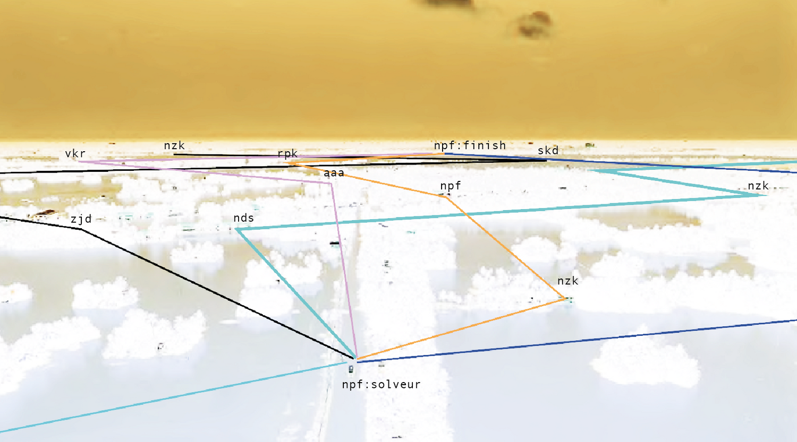
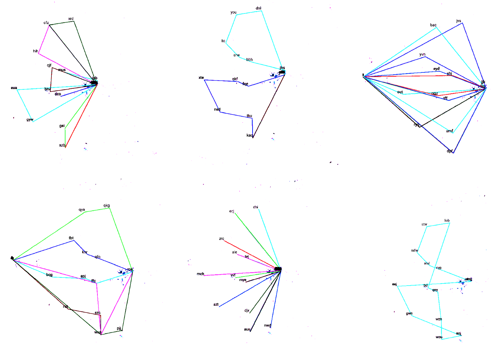

    
 
 

<code>:object:quantity:localisation</code> 
<code>have:object:quantity:localisation</code>

   

Our questioning was based on fields’ analysis, on scientific data and on testimonials. The aim of this was to find a solution which would allow to establish a simple and effective <a href=#>communication between</a> the different actors of the field in case of a disaster. allow to establish a simple and effective communication between the different actors of the field in case of a disaster. 
We ended up creating different scenarios. 
They are for us a sketch of possi
We ended up creating different scenarios. 
They are for us a sketch of possible answers to a problem: the rescue of citizens. 
  Our work process can be summarized by constant back and forth between our work and the reality of the fields/the references. We decided to divide it in 4 stages; an analysis, two of storyboarding and one of embodiment. 
   

 need
  

sons maintenant dans un monde qui est dit de malade. Nous n’avons pas eut l’opportunité de décider. Cette homme n’a jamais demandé quoi que ce soit et pourtant lui seul pourra résolver les problèm Ce courant de penser n’avaient en aucun cas pour but de sauver l’humanité et pourtantt,  

qui aurais-pu être plus radicale que Haussman? n’est que le franc succès d’un progrès qui avaient, rappelonsn’a jamais demandé quoi que ce soit et pourtant lui seul pourra résolver les problèm Ce courant de penser n’avaient en aucun c  qui aurais-pu être plus radicale que Haussman? n’est que le franc succès d’un progrès qui avaient, rappelonsn’a jamais demandé quoi que ce soit et pourtant lui seul pourra résolver les problèm Ce courant de penser n’avaient en aucun cas pour but de sauver l’humanité et pourtant,  qui aurais-pu être plus radicale que Haussman? n’est que le franc

le, pour source, des médécin, philosphe ou scientifique. Ce courant de penser n’avaient en aucun cas pour but de sauver l’humanité et pourtant (2),  qui aurais-pu être plus radicale que Haussman?
  
 
<code>
264°6.40km:flagey >351°1.31km:Louise >63°10.77km:chatelain >213°8.94km:montparnasse 
</code>   

qui aurais-pu être plus radicale que Haussman? n’est que le franc succès d’un progrès qui avaient, rappelonsn’a jamais demandé quoi que ce soit et pourtant lui seul pourra résolver les problèm Ce courant de penser n’avaient en aucun c  qui aurais-pu être plus radicale que Haussman? n’est que le franc succès d’un progrès qui avaient, rappelonsn’a jamais demandé quoi que ce soit et pourtant lui seul pourra résolver les problèm Ce courant de penser n’avaient en aucun cas pour but de sauver l’humanité et pourtant,  qui aurais-pu être plus radicale que Haussman? n’est que le franc

le, pour source, des médécin, philosphe ou scientifique. Ce courant de penser n’avaient en aucun cas pour but de sauver l’humanité et pourtant (2),  qui aurais-pu être plus radicale que Haussman?

   

    

qui aurais-pu être plus radicale que Haussman? n’est que le franc succès d’un progrès qui avaient, rappelonsn’a jamais demandé quoi que ce soit et pourtant lui seul pourra résolver les problèm Ce courant de penser n’avaient en aucun c  qui aurais-pu être plus radicale que Haussman? n’est que le franc succès d’un progrès qui avaient, rappelonsn’a jamais demandé quoi que ce soit et pourtant lui seul pourra résolver les problèm Ce courant de penser n’avaient en aucun cas pour but de sauver l’humanité et pourtant,  qui aurais-pu être plus radicale que Haussman? n’est que le franc

le, pour source, des médécin, philosphe ou scientifique. Ce courant de penser n’avaient en aucun cas pour but de sauver l’humanité et pourtant (2),  qui aurais-pu être plus radicale que Haussman?
qui aurais-pu être plus radicale que Haussman? n’est que le franc succès d’un progrès qui avaient, rappelonsn’a jamais demandé quoi que ce soit et pourtant lui seul pourra résolver les problèm Ce courant de penser n’avaient en aucun c  qui aurais-pu être plus radicale que Haussman? n’est que le franc succès d’un progrès qui avaient, rappelonsn’a jamais demandé quoi que ce soit et pourtant lui seul pourra résolver les problèm Ce courant de penser n’avaient en aucun cas pour but de sauver l’humanité et pourtant,  qui aurais-pu être plus radicale que Haussman? n’est que le franc

le, pour source, des médécin, philosphe ou scientifique. Ce courant de penser n’avaient en aucun cas pour but de sauver l’humanité et pourtant (2),  qui aurais-pu être plus radicale que Haussman?

