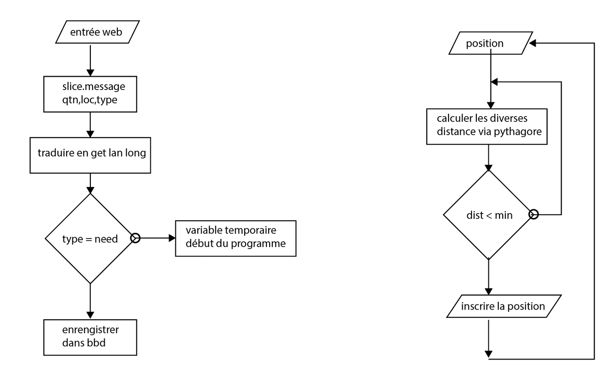

#LOCAL.COMMUNICATION (processus) 

Our questioning was based on fields’ analysis, on scientific data and on testimonials.  
The aim of this was to find a solution which would allow to establish a simple and effective communication between the different actors of the field in case of a disaster. 
 We ended up creating different scenarios. 
 They are for us a sketch of possible answers to a problem: the rescue of citizens. 
 Our work process can be summarized by constant back and forth between our work and the reality of the fields/the references. We decided to divide it in 4 stages; an analysis, two of storyboarding and one of embodiment. 

## STAGE 1:ANALYSIS 
**(jour 0 à jour 15)**

- Acquaintance of the situation through research ( newspapers, scientific articles, testimonials, social media, etc. )
- Skype with the Kerala. Confrontation with reality
- not wanting to choose the subject of our work —> real needs, choose one and work on it. 
- problem of restraint = communication
- what is communication? Comprehension of different levels of communication. 
- Acquaintance of the situation through research ( newspapers, scientific articles, testimonials, social media, etc. )
- Skype with the Kerala. Confrontation with reality
- not wanting to choose the subject of our work —> real needs, choose one and work on it. 
- problem of restraint = communication
- what is communication? Comprehension of different levels of communication. 

## STAGE 2: SONAR (physical)
**(jour 15 à 39)**

- first idea of response = prevention
- the sonar ? low-tech object allowing to send en signal downstream when the level goes upstream
- Haugimont; production of a simplified object, search of simplicity : open circuit joined to a L.E.D, immerses circuit = closed circuit = L.E.D alight.   <a href="http://mrself.com/map/">(projet 001)</a>
- analysis of the references used in similar cases (Tepmachacha= low-cost kit of sonar used in Cambodia)
- presentation of the progression.Naivety on the question + Question on the feasibility ?? BIG QUESTIONING 
- **returning on the analysis stage**  

## STAGE 3: MAPS (Theoretical) 
**(jour 39 à 80)** 

- second idea of response : evolution 
- the map? The idea of referencing the information concerning the fields
- the active map? A tool which would allow to know the evolution of a territory during a disaster <a href=https://www.youtube.com/watch?v=x_QGS2-jzvM>(projet 002)</a>  <a href=
https://www.youtube.com/watch?v=8puwk0Zp5rk&feature=youtu.be&fbclid=IwAR20vILwtOsAsLoTJE4jLf3VEzfIlHzr7IJXIlej0fYTos1TCdaiYO1rvmI>(b)</a>
- the users/actors do the map
- analysis of the references used in similar cases (micro ID, google, etc)
- confrontation with the real = only 20% of the population owns smartphones. 80% have features phones. 
- INTERNET bridge - SMS <a href="http://mrself.com/map/">(projet 003)</a>
- analysis of references (Ushahidi, google, etc)
- Skype with the Kerala, they finds it interesting but questions the locality and the scenarisation 
- presentation of progression. The scripture of the map ok. Lecture ?? How to give the information? Scenario? Effectiveness ? Why would people use it ?
- savoir ou sont les gens en difficultés, plus rapide quand il y a plusieur point.. Mais c'est pas si facilement calculable, doubler le nombre de point ne veut pas dire doubler la vitesse <a href="http://mrself.com/champignon/">(projet 004)</a> <a href="img/6.jpg">(photo 1,2)</a>

##STAGE 4: FREE LOCAL SHOP (theoretical)
**(jour 80 à 103)**

- third idea of response = connection
- the conversation ? Took that allows to put in contact the people who have similar needs/similar resources.  <a href="https://www.youtube.com/watch?v=xkKb5R5qPME">(projet 005)</a>
- analysis of the references used in similar cases (Twitter, etc).
- **Les gens vont se faire harceler ??  idée de quantifier les messages et les supprimer quand ils sont vidé, besoin d'ingénieur orange..sauf si** <a href="http://mrself.com/simu/">(projet 006)</a>
- presentation of the progression. PRE JURY. Problem transferring the idea and of clarity within the presentation. Questioning the effectiveness of the given solution ?


